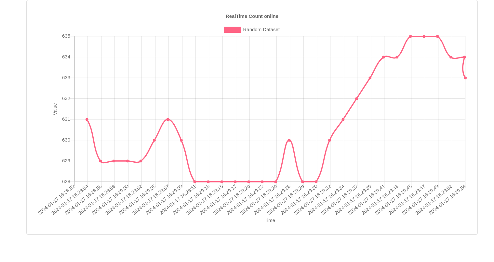

# RealTime OnlineNums Count

---
A simple tool used to show the Realtime Online number of NJtech Online



## _How to run:_

First, you need to make sure that you have all the packages in the _requirements.txt_,

use the command below to install 
```
pip install -r requirements.txt 
```

Then you can run it by use:
```
python app.py
```

If everything goes right, you can check the [127.0.0.1:5000](127.0.0.1:5000) to see the dynamic figure.

## Refrence
This project is modified from this repo
[Creating Real-Time Charts with Flask](https://github.com/roniemartinez/real-time-charts-with-flask/tree/master)


